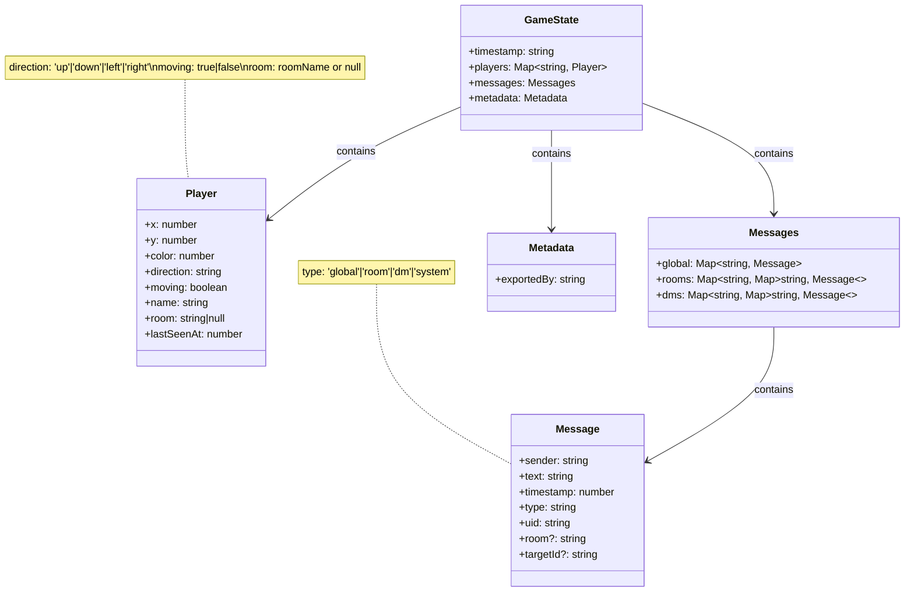

```mermaid
classDiagram
    class GameState {
        +timestamp: string
        +players: Map~string, Player~
        +messages: Messages
        +metadata: Metadata
    }

    class Player {
        +x: number
        +y: number
        +color: number
        +direction: string
        +moving: boolean
        +name: string
        +room: string|null
        +lastSeenAt: number
    }

    class Messages {
        +global: Map~string, Message~
        +rooms: Map~string, Map~string, Message~~
        +dms: Map~string, Map~string, Message~~
    }

    class Message {
        +sender: string
        +text: string
        +timestamp: number
        +type: string
        +uid: string
        +room?: string
        +targetId?: string
    }

    class Metadata {
        +exportedBy: string
    }

    GameState --> Player: contains
    GameState --> Messages: contains
    GameState --> Metadata: contains
    Messages --> Message: contains

    note for Player "direction: 'up'|'down'|'left'|'right'\nmoving: true|false\nroom: roomName or null"
    note for Message "type: 'global'|'room'|'dm'|'system'"
``` 