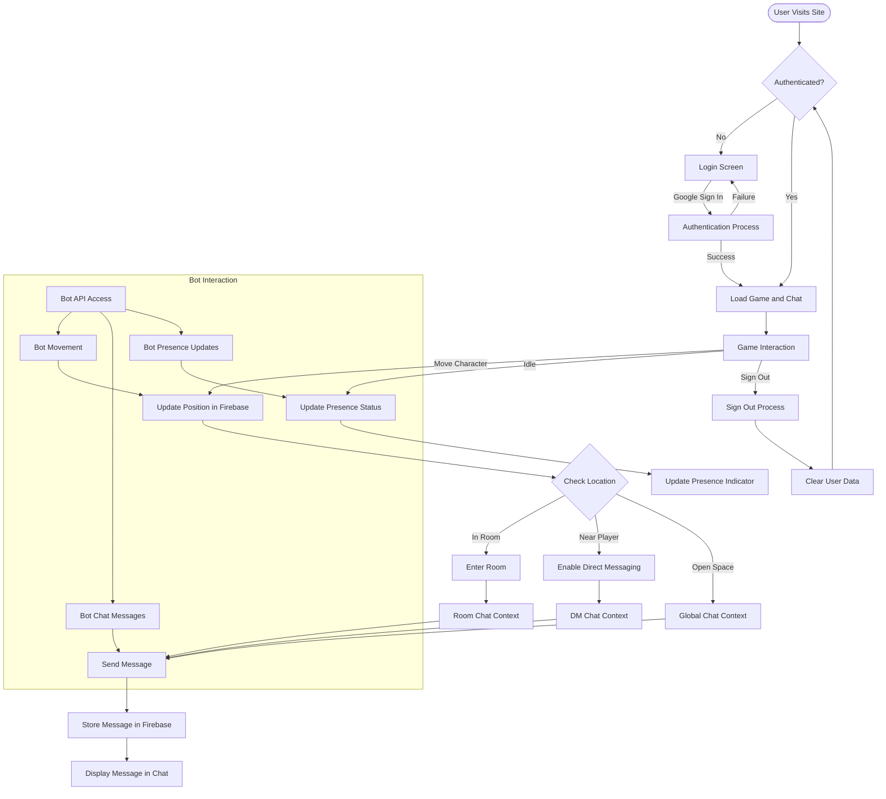

```mermaid
flowchart TD
    Start([User Visits Site]) --> Auth{Authenticated?}
    Auth -->|No| Login[Login Screen]
    Login -->|Google Sign In| AuthProcess[Authentication Process]
    AuthProcess -->|Success| LoadGame
    AuthProcess -->|Failure| Login
    
    Auth -->|Yes| LoadGame[Load Game and Chat]
    
    LoadGame --> GameInteraction[Game Interaction]
    
    GameInteraction -->|Move Character| UpdatePosition[Update Position in Firebase]
    UpdatePosition --> CheckLocation{Check Location}
    
    CheckLocation -->|In Room| EnterRoom[Enter Room]
    CheckLocation -->|Near Player| EnableDM[Enable Direct Messaging]
    CheckLocation -->|Open Space| GlobalChat[Global Chat Context]
    
    EnterRoom --> RoomChat[Room Chat Context]
    EnableDM --> DMChat[DM Chat Context]
    
    RoomChat --> SendMessage[Send Message]
    DMChat --> SendMessage
    GlobalChat --> SendMessage
    
    SendMessage --> StoreMessage[Store Message in Firebase]
    StoreMessage --> DisplayMessage[Display Message in Chat]
    
    GameInteraction -->|Idle| UpdatePresence[Update Presence Status]
    UpdatePresence --> PresenceIndicator[Update Presence Indicator]
    
    GameInteraction -->|Sign Out| SignOut[Sign Out Process]
    SignOut --> ClearData[Clear User Data]
    ClearData --> Auth
    
    subgraph "Bot Interaction"
        BotAPI[Bot API Access]
        BotMove[Bot Movement]
        BotChat[Bot Chat Messages]
        BotPresence[Bot Presence Updates]
        
        BotAPI --> BotMove
        BotAPI --> BotChat
        BotAPI --> BotPresence
        
        BotMove --> UpdatePosition
        BotChat --> SendMessage
        BotPresence --> UpdatePresence
    end
``` 