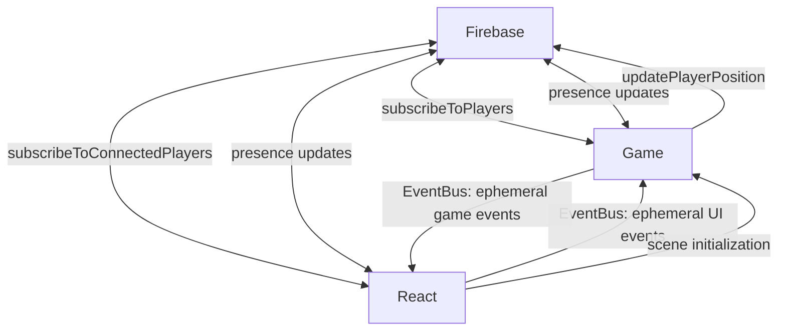

# State Synchronization Patterns

This document outlines how state flows between Firebase, React, and the Phaser game in our application. Rather than having strict ownership of state, we use different synchronization mechanisms based on the nature of the state and interaction needs.

## Core Principles

1. Firebase is the source of truth for persistent state
2. React handles UI state and authentication
3. Phaser handles game state and input
4. EventBus facilitates direct React-Phaser communication for ephemeral state only
5. If state exists in Firebase, components should sync through Firebase, not EventBus

## State Flow Patterns



## Communication Methods

### Firebase Subscriptions
Used for ALL persistent or shared state that needs real-time updates across clients:
- Player positions
- Online presence
- User profiles
- Chat messages
- Any state that multiple components need to read/write

```typescript
// Example: Both Game and React components can update presence
// Game: Movement updates presence
updatePlayerPosition(uid, newX, newY, direction, isMoving).then(() => {
    updatePresenceTimestamp(uid);
});

// React: Chat updates presence
sendChatMessage(text, roomId).then(() => {
    updatePresenceTimestamp(uid);
});

// Both subscribe to presence
subscribeToPresence((presenceData) => {
    updateOnlineIndicators(presenceData);
});
```

### EventBus Communication
Used ONLY for ephemeral React-Phaser communication that doesn't need persistence:
- Scene initialization/ready states
- Temporary UI overlays
- One-time game events
- Local player interactions that don't affect persistent state

```typescript
// Good: Ephemeral UI event
EventBus.emit('showTemporaryEmote', { type: 'wave' });

// BAD: Don't use EventBus for persistent state
// EventBus.emit('playerMoved', { x, y }); // Wrong! Use Firebase instead
```

### Direct Updates to Firebase
Used whenever state needs to be:
- Persisted
- Shared between components
- Synchronized across clients
- Available after page refresh

```typescript
// Example: Complex presence updates from multiple sources
// Both Game and React components can update presence
const updatePresenceTimestamp = async (uid: string) => {
    const presenceRef = ref(database, `players/${uid}/lastSeenAt`);
    await set(presenceRef, serverTimestamp());
};
```

## Common Patterns

### Player Movement
1. User input in Game scene
2. Local sprite updates immediately
3. Position update sent to Firebase
4. Other clients receive update via Firebase subscription
5. Both Game and React components can react to the Firebase update

### Player Presence (Complex Example)
Presence is a complex case where multiple components need to both read and write:

1. Multiple triggers update presence:
   - Player movement (Game)
   - Chat messages (React)
   - Regular heartbeat (React)
   - User actions (React)

2. Multiple components need presence:
   - Game scene (player sprites)
   - UI (online indicators)
   - Chat system (user status)

3. Solution:
   - All updates go through Firebase
   - Both Game and React subscribe to presence
   - Use server timestamps for consistency
   - Handle offline/disconnect cases

```typescript
// Example presence implementation
const setupPresence = (uid: string) => {
    // Update presence on multiple triggers
    const updatePresence = () => {
        const presenceRef = ref(database, `players/${uid}/lastSeenAt`);
        set(presenceRef, serverTimestamp());
    };

    // Game movement updates presence
    onPlayerMove(() => updatePresence());

    // React chat updates presence
    onChatMessage(() => updatePresence());

    // Regular heartbeat
    setInterval(updatePresence, 60000);

    // Cleanup on disconnect
    const presenceRef = ref(database, `players/${uid}`);
    onDisconnect(presenceRef).update({
        lastSeenAt: null,
        isOnline: false
    });
};
```

### Scene Management
1. React creates game instance
2. Game scene loads
3. Scene notifies React via EventBus (ephemeral event)
4. React configures scene
5. Scene begins normal operation, using Firebase for state

## Anti-patterns to Avoid

1. **Don't Use EventBus for Persistent State**
   - If state exists in Firebase, always sync through Firebase
   - EventBus is only for truly ephemeral events

2. **Don't Duplicate State Sync Methods**
   - Choose either Firebase or EventBus based on persistence needs
   - Don't sync the same state through both systems

3. **Don't Block on Network**
   - Update local state immediately
   - Use Firebase for eventual consistency
   - Handle conflicts gracefully

4. **Don't Treat Components as State Owners**
   - Components are observers and updaters of shared state
   - State lives in Firebase, not in components

## Adding New Features

When adding new features, consider:

1. **Is the state ephemeral or persistent?**
   - Persistent: MUST use Firebase
   - Truly ephemeral: Use EventBus
   - When in doubt, prefer Firebase

2. **Do multiple components need this state?**
   - Yes, and it's persistent: Use Firebase
   - Yes, but it's truly ephemeral: Use EventBus
   - No: Use local state

3. **Will this state need to survive page refresh?**
   - Yes: Must use Firebase
   - No: Can use EventBus or local state

4. **Do multiple components need to update this state?**
   - Yes: Follow presence pattern with Firebase
   - No: Still consider Firebase if state is persistent

Remember: The goal is predictable state synchronization. Firebase is our primary sync mechanism, with EventBus reserved only for ephemeral communication between React and Phaser. 